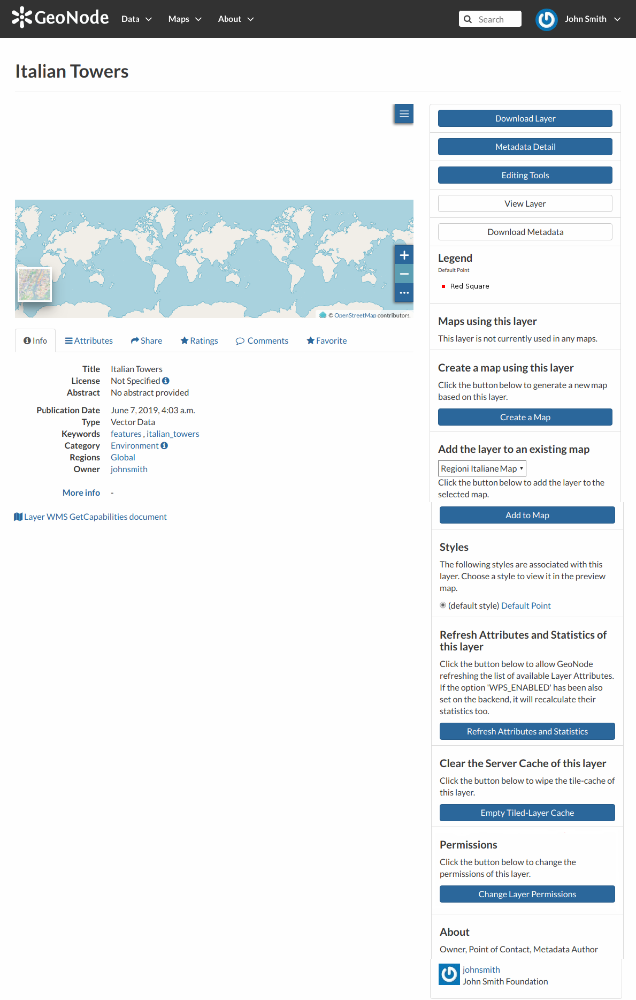

.. _layer-info:

Layer Information
=================

| In this section you will learn more about layers. In the :ref:`finding-layers` section we explain how to find layers, now we want to go more in depth showing you how to explore detailed information about that.
| From the layers list page, click on the layer you are interested in. The *Layer Page* will open.

    *Layer Information*

As shown in the picture above, the *Layer Page* is divided in three main sections:

1. the *Layer Preview* section, under the title
2. the *Tabs* section, under the layer preview
3. the *Tools* section, on the right side of the page

Layer Preview
-------------

The *Layer Preview* shows the layer in a map with very basic functionalities:

* the *Base Map Switcher* that allows you to change the base map;
* the *Zoom in/out* tool to enlarge and decrease the view;
* the *Zoom to max extent* tool for the zoom to fit the layer size;
* the *Query Objects* tool to retrieve information about the map objects by clicking on the map;
* the *Print* tool to print the preview.

.. figure:: img/layer_preview.gif
    :align: center

    *Layer Preview*

The GeoNode map viewer is `MapStore <https://mapstore2.geo-solutions.it/mapstore/#/>`_ based, see the `MapStore Documentation <https://mapstore2.readthedocs.io/en/latest/>`_ to learn more.

Tabs Sections
-------------

The *Layer Page* shows you some tabs sections containing different information about the layer:

* The tab *Info* is active by default. The *Info* tab section shows some layer metadata such as its title, the abstract, date of publication etc. The metadata also indicates the layer owner, what are the topic categories the layer belongs to and which regions are affected.

  .. figure:: img/layer_info_tab.png
      :align: center

      *Layer Info tab*

* The *Attributes* tab shows the data structure behind the layer. All the attributes are listed and for each of them some statistics (e.g. the range of values) are estimated (if possible).

  .. figure:: img/layer_attributes_tab.png
      :align: center

      *Layer Attributes tab*

* The *Share* tab provides the links for the layer to share through social media or email.

  .. figure:: img/layer_sharing.png
      :align: center

      *Layer Sharing*

* You can *Rate* the layer through the *Ratings system*.

  .. figure:: img/layer_rating.png
      :align: center

      *Rate the Layer*

* In the *Comments* tab section you can post your comment. Click on :guilabel:`Add Comment`, insert your comment and click :guilabel:`Submit Comment` to post it.

  .. figure:: img/layer_comments.png
      :align: center

      *Layer Comments*

  Your comment will be added next to the last already existing comment. If you want to remove it click on the red :guilabel:`Delete` button.

* If you want this layer in your *Favorites* (see :ref:`editing-profile`), open the *Favorite* tab and click on :guilabel:`Add to Favorites`.

  .. figure:: img/favorite_layer.png
      :align: center

      *Your Favorite Layer*

Layer Tools
-----------

In the right side of the *Layer Page* there are some buttons and information that can help you to manage your layer. This paragraph will cover only those tools which show layers information without changes data. The *Editing Tools* will be explored in the :ref:`layer-editing`.

* :guilabel:`Metadata Detail`
* :guilabel:`View Layer`
* :guilabel:`Download Metadata`
* *Legend*
* *Map using this layer*
* *Create a map using this layer* :guilabel:`Create a Map`
* *Add the layer to an existing map* :guilabel:`Add to Map`
* *Styles*
* *Refresh Attributes and Statistics of this layer* :guilabel:`Refresh Attributes and Statistics`
* *Clear the Server Cache of this layer* :guilabel:`Empty Tiled-Layer Cache`
* *About*
